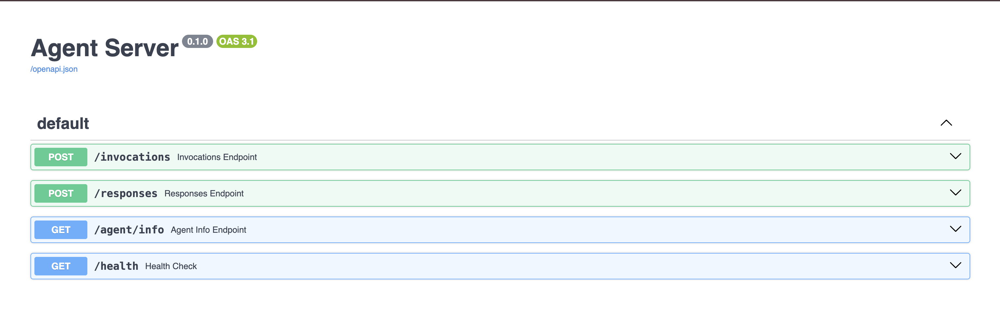

# Demo Agent Server

This is a simple demo agent server that uses [MLflow's AgentServer]() to create a U.S. National Park Service agent endpoint on Openshift.

## Prerequisites

- [Sign up for a National Park Service API Key](https://www.nps.gov/subjects/developer/get-started.htm) - it is completely free and quick

## Run Locally


1. Copy `.env.example` to `.env` and fill in environment variables:

    ```sh
    cp .env.example .env
    ```

2. Install dependencies:

    ```sh
    uv sync
    ```

3. Run the MLflow server:

    ```sh
    uv run mlflow server
    ```

4. In a separate terminal, run the agent server:

    ```sh
    uv run start_server.py
    ```

5. Test the agent server:

    ```sh
    curl -X POST http://localhost:8000/invocations \
        -H "Content-Type: application/json" \
        -d '{ "input": [{ "role": "user", "content": "What campgrounds are available at the grand canyon?"}]}'
    ```

## Run on Openshift

1. Set these variables in your terminal according to your deployment environment:

    ```sh
    export NAMESPACE=""
    export MLFLOW_TRACKING_URI=""
    export MLFLOW_EXPERIMENT_NAME=""
    export NPS_API_KEY=""
    export OPENAI_API_KEY=""
    # export OPENAI_BASE_URL=""
    # export OPENAI_MODEL_NAME=""
    ```

2. Create a secret with your OpenAI configuration and NPS API key:

    ```sh
    oc create secret generic demo-agent-server-secret \
        -n $NAMESPACE \
        --from-literal=OPENAI_API_KEY=$OPENAI_API_KEY \
        # --from-literal=OPENAI_BASE_URL=$OPENAI_BASE_URL \
        # --from-literal=OPENAI_MODEL_NAME=$OPENAI_MODEL_NAME \
        --from-literal=NPS_API_KEY=$NPS_API_KEY
    ```

3. Deploy the Agent Server to your cluster:

    ```sh
    oc process -f deploy.yaml \
        -p NAMESPACE=$NAMESPACE \
        -p MLFLOW_TRACKING_URI=$MLFLOW_TRACKING_URI \
        -p MLFLOW_EXPERIMENT_NAME=$MLFLOW_EXPERIMENT_NAME \
        | oc apply -f -
    ```

4. Get the route:

    ```sh
    ROUTE=$(oc get route demo-agent-server -n $NAMESPACE -o jsonpath={.spec.host})
    ROUTE="https://${ROUTE}"
    ```

5. Check the service is live by navigating to the route `/docs` endpoint

    ```sh
    echo "${ROUTE}/docs"
    ```

    You should see the documentation page for the agent server.

    

6. Test the agent server
   
    ```sh
    curl -X POST "${ROUTE}/invocations" \
        -H "Content-Type: application/json" \
        -d '{ "input": [{ "role": "user", "content": "What campgrounds are available at the grand canyon?"}]}'
    ```